# Skills Registry


A curated collection of production-grade Claude Code skills.

> ⚠ **Trust Warning**: Make sure you trust a plugin before installing. Anthropic does not control what MCP servers, files, or other software are included in plugins and cannot verify that they will work as intended. See each plugin's homepage for more information.

## Available Skills

| Skill | Description | Version |
|-------|-------------|---------|
| **svg-diagram** | Production-grade SVG diagrams: sequence, flowchart, architecture, ERD, state machine, timeline. Dark mode, semantic colors, CJK support. | 1.0.0 |
| **poly-wiki** | Multi-platform knowledge base compiler. Compile raw materials into structured knowledge, maintain a reusable knowledge network. | 1.0.0 |

## Installation

```bash
# Add marketplace
/plugin marketplace add https://github.com/wunamesst/skills

# Install individual skills
/plugin install svg-diagram@svg-diagram-marketplace
/plugin install poly-wiki@svg-diagram-marketplace
```

Or install locally without marketplace:
```bash
ln -sf $(pwd)/skills/svg-diagram ~/.claude/skills/svg-diagram
ln -sf $(pwd)/skills/poly-wiki ~/.claude/skills/poly-wiki
```

---

## svg-diagram

Hand-written SVG diagrams for software architecture and documentation.

### Usage

After installation, just describe what you need in natural language — the skill activates automatically when it detects a diagram request.

**Direct invocation:**
```
/svg-diagram 画一个用户登录的时序图
/svg-diagram draw a CI/CD pipeline flowchart
```

**Natural language triggers (auto-detected):**
```
画一个 OAuth2 认证流程的时序图
Draw the microservice architecture for an order system
帮我画一个 DDD 分层架构图
```

**Supported diagram types:**

| Type | Trigger examples |
|------|-----------------|
| Sequence | "时序图", "调用链", "sequence diagram" |
| Flowchart | "流程图", "决策流程", "flowchart" |
| Architecture | "架构图", "组件关系", "architecture" |
| State machine | "状态机", "生命周期", "state machine" |
| Timeline | "时间线", "里程碑", "timeline" |
| ERD | "ER图", "数据库表关系", "ER diagram" |
| Interactive | "交互式", "可点击", "interactive widget" |

Output files are written to `output/` and opened in your browser automatically.

### Example Output

<table>
  <tr>
    <td align="center"><b>Sequence Diagram</b></td>
    <td align="center"><b>Flowchart</b></td>
    <td align="center"><b>Architecture Diagram</b></td>
  </tr>
  <tr>
    <td></td>
    <td></td>
    <td></td>
  </tr>
</table>

### SVG to PNG Conversion

```bash
# One-time setup
cd skills/svg-diagram/scripts && npm install

# Usage
node svg2png.mjs output/diagram.svg            # @2x (default)
node svg2png.mjs output/diagram.svg -s 3       # @3x
node svg2png.mjs output/diagram.svg -o out.png  # custom output path
```

---

## poly-wiki

Multi-platform knowledge base compiler based on the Andrej Karpathy LLM Wiki concept. Distills structured knowledge from fragmented materials.

Supports: Claude Code, Codex CLI, OpenClaw, Cursor, Gemini CLI, VS Code Copilot.

### Usage

**Commands:**

| Command | Description |
|---------|-------------|
| `/poly-wiki:ingest [path]` | Compile Raw materials to Wiki |
| `/poly-wiki:extract <source> <target>` | Extract patterns from Personal/Work |
| `/poly-wiki:lint` | Wiki health check |
| `/poly-wiki:query <question>` | Query and archive knowledge |

**Natural language triggers (auto-detected):**
```
把 01_Raw 里的新文章编译到知识库
从 CRM 方案里萃取通用的设计模式
检查一下知识库有没有断裂链接
```

### Directory Structure

```
your-wiki/
├── 00_SYSTEM/
│   ├── SCHEMA.md          ← Rules (deployed from skill)
│   ├── INGEST_LOG.md      ← Auto-created
│   └── LINT_LOG.md        ← Auto-created
├── 01_Raw/                ← External materials (read-only)
├── 02_Wiki/               ← Compiled knowledge
├── 03_Personal/           ← Personal archive
└── 04_Work/               ← Work documents
```

---

## License

MIT
